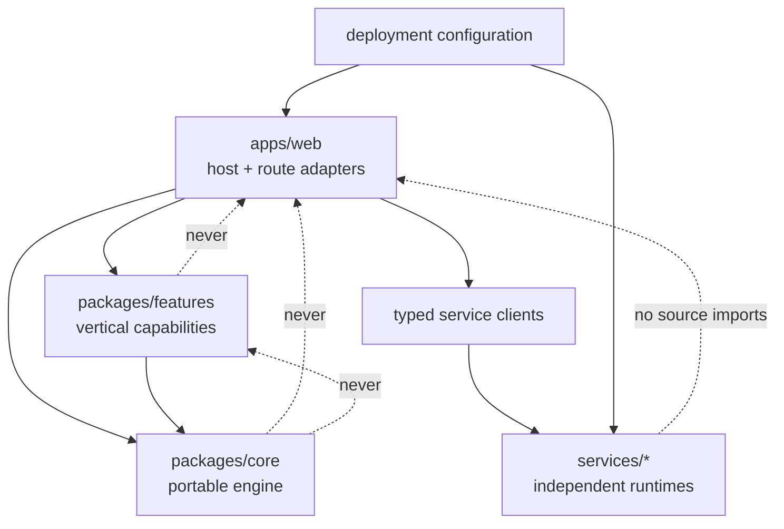

# ADR-001: Stabilize, Then Simplify the Repository Infrastructure

**Status:** Proposed  
**Date:** 2026-07-24  
**Deciders:** Repository maintainers, application owners, and deployment owners

## Context

The repository has recently moved toward a pnpm monorepo with a portable core,
internal feature modules, and a Next.js host. The direction is useful, but the
migration is only partly complete:

- most product code and all HTTP/background-job orchestration remain in one
  large web application
- auxiliary runtimes are outside the workspace and mostly outside CI
- package contracts and runtime service contracts do not always match
- Vercel, Docker, and database migration paths have drifted
- legacy shims and direct environment reads coexist with the new engine/port
  model

Several people are actively changing the repository. A broad rename, service
split, or route migration would create unnecessary conflicts and make behavior
regressions difficult to isolate.

Constraints:

- preserve public URLs, event names, table names, and stored data
- preserve the ability to deploy on Vercel and through Docker
- preserve `@launchstack/core` as a publishable package
- avoid a big-bang rewrite or a long-lived migration branch
- keep each cleanup step reviewable and independently reversible

## Decision

Adopt a staged stabilization strategy.

First make current boundaries, contracts, deployment roots, and ownership
explicit. Then finish the existing core/features/host migration. Only after
those contracts are tested should directories move or services split.

The target dependency direction is:



The first cleanup work should change documentation, tests, and guardrails—not
runtime topology.

## Options considered

### Option A: Documentation only

| Dimension                 | Assessment |
| ------------------------- | ---------- |
| Initial complexity        | Low        |
| Merge-conflict risk       | Low        |
| Runtime risk reduction    | Low        |
| Long-term maintainability | Low        |

**Pros**

- fastest and safest immediate change
- gives contributors a shared vocabulary

**Cons**

- contracts and deployment paths continue to drift
- CI blind spots and duplicate implementations remain

### Option B: Immediate repository reorganization

| Dimension                 | Assessment       |
| ------------------------- | ---------------- |
| Initial complexity        | High             |
| Merge-conflict risk       | High             |
| Runtime risk reduction    | Uncertain        |
| Long-term maintainability | Potentially high |

**Pros**

- reaches a visually clean directory layout quickly
- forces ownership decisions

**Cons**

- large file moves collide with active work
- behavior changes, import changes, and deployment changes become entangled
- difficult to roll back individual decisions

### Option C: Staged stabilization and migration

| Dimension                 | Assessment    |
| ------------------------- | ------------- |
| Initial complexity        | Medium        |
| Merge-conflict risk       | Low to medium |
| Runtime risk reduction    | High          |
| Long-term maintainability | High          |

**Pros**

- validates contracts before changing topology
- keeps PRs small and reversible
- preserves current URLs and data
- lets production evidence determine whether services should merge or split

**Cons**

- the directory tree remains imperfect for a while
- requires maintainers to enforce sequencing and exit criteria

## Trade-off analysis

Option C is recommended. The repository's main problem is not the visual shape
of the folders; it is that the same capability can have multiple configuration,
implementation, and deployment paths. Moving those paths before choosing the
authoritative one would make the ambiguity harder to debug.

## Target invariants

The cleanup is complete when these statements are true:

1. `packages/core` has no framework imports or direct environment reads.
2. `packages/features` depends only on core and injected runtime configuration.
3. `apps/web` is the only composition root for the Next.js process.
4. Every auxiliary service has a versioned contract and a contract test.
5. Every deployable runtime is built and tested in CI.
6. Vercel has one documented project root and one authoritative config.
7. Docker and Vercel apply the same ordered database migrations.
8. Optional capabilities can be disabled without preventing the base app from
   starting.
9. Each product domain has an owner and one application-service entry path,
   even if its public API routes remain distributed under `src/app/api`.
10. Documentation paths and diagrams are checked as part of normal changes.

## Phased plan

### Phase 0: Baseline and ownership

**Change size:** documentation only

- land the current-state code map
- name owners for web, core, database migrations, Vercel, Docker, OCR, and Adeu
- record which production deployment path is active for each runtime
- mark planned feature scaffolds as roadmap-only

**Exit criteria:** maintainers agree that the map reflects production reality,
or annotate the few places where production configuration differs.

### Phase 1: Contracts and deployment truth

**Change size:** small test/config PRs

- choose and test the Vercel root (`./` or `apps/web`), then fix the config and
  all deployment links together
- decide whether `api/adeu` or containerized Adeu is authoritative; add parity
  tests before retiring either one
- define an OpenAPI or checked JSON contract for OCR and sidecar endpoints
- either implement `/embed`, `/rerank`, and `/extract-entities` or remove those
  advertised modes and fail configuration validation early
- make sidecar/OCR dependencies optional Compose profiles when the web app can
  fall back to cloud providers

**Exit criteria:** a deployment smoke test and service contract tests fail
before an incompatible change can merge.

### Phase 2: Put every runtime under validation

**Change size:** CI-only or test-only PRs

- add `services/ocr-router` to the package/workspace build graph, or document
  why it intentionally remains an isolated npm project
- add OCR router build/test, Python unit tests, Dockerfile builds, and a minimal
  Compose integration smoke test to CI
- pin container image versions and produce locked Python dependencies
- require the existing check workflow before deploy because Next builds
  currently ignore lint and TypeScript failures

**Exit criteria:** every deployable artifact is built on pull requests, and
dependency versions are reproducible.

### Phase 3: Finish the core/features/host boundary

**Change size:** one capability per PR

- replace core `process.env` fallbacks with explicit config
- replace module-level configuration slots where practical with instance
  dependencies; keep compatibility adapters during migration
- route new web callers through `getEngine()` or a domain application service
- consolidate duplicate RAG, LLM, OCR, storage, credits, and job abstractions
  only after import-usage tests show which implementation is authoritative
- pass a typed runtime config into features instead of adding new environment
  reads

**Exit criteria:** lint rules describe actual code, compatibility shims have
measured usage, and each shim has a removal issue/date.

### Phase 4: Unify data-change ownership

**Change size:** migration tooling and documentation; no table renames

- keep schema declarations in one package and ordered migrations in one
  authoritative directory
- make local, Docker, CI, and Vercel run the same forward migration command
- separate data backfills from schema application and make both idempotent
- add a clean-database migration test and an upgrade-from-last-release test

**Exit criteria:** no environment uses `db:push` as a substitute for production
migrations, and rollback guidance explicitly uses forward corrective migrations.

**Status: done.** Migrations live in `packages/core/drizzle`, generated from the
schema beside them. Local dev, CI, Docker and Vercel production all run
`db:migrate`; `drizzle-kit push` is blocked on every deploy path by
`scripts/ci/check-no-push.mjs` and by a runtime guard that refuses to push into
a migration-managed database. The 17 hand-written files in `apps/web/drizzle`
(which could not build a database from empty) were squashed into one reviewed
baseline. Backfills moved to a separate resumable subsystem with its own ledger
and are no longer run on container boot. CI has clean-database, idempotence,
schema-parity and upgrade-from-last-release jobs.

### Phase 5: Organize the host by product domain

**Change size:** incremental internal moves with stable URLs

- introduce domain application-service modules for documents, workspaces,
  identity, notes, legal generation, marketing, and research
- keep Next route files as thin authentication/validation/response adapters
- centralize company/workspace authorization helpers
- move one domain at a time; do not rename public routes or Inngest events

**Exit criteria:** route handlers contain transport logic, while business logic
is tested behind domain entry points.

### Phase 6: Normalize directories only after contracts are stable

**Change size:** mechanical moves in dedicated PRs

A likely final shape is:

```text
apps/
  web/
packages/
  core/
  features/
services/
  sidecar/          # or smaller capability services if evidence supports it
  ocr-router/
  ocr-worker/
  adeu-vercel/      # only if the serverless adapter is retained
infra/
  compose/
  docker/
docs/
  architecture/
  deployment/
```

Do not split the current sidecar merely to make the tree symmetric. Adeu and
Whisper have different scaling/dependency profiles, so a split may be useful,
but it should be decided using deployment frequency, cold-start time, resource
usage, and ownership—not folder aesthetics.

**Exit criteria:** paths reflect established ownership and deployment units;
no move is combined with a behavior change.

## Suggested pull-request sequence

Each item is intended to be independently mergeable:

1. Current-state map and proposed ADR.
2. Production deployment inventory and Vercel-root decision.
3. Sidecar/OCR contract tests and configuration validation.
4. CI coverage for all Dockerfiles and non-web runtimes.
5. One authoritative Adeu deployment decision, with parity tests.
6. Core configuration cleanup, one subsystem at a time.
7. One database migration command across local, CI, Docker, and Vercel.
8. Domain authorization helper and one pilot thin-route conversion.
9. Mechanical service-directory normalization.
10. Remove compatibility shims only after usage reaches zero.

Avoid combining adjacent items into one large PR.

## Validation and rollback

For every phase:

- preserve route paths, event names, environment variable aliases, and table
  names until their replacements have been deployed
- add a contract or characterization test before moving implementation
- use additive database changes followed by backfill and later cleanup
- make directory moves separate commits from code changes
- retain a compatibility re-export for one release when package imports change
- roll back application code independently; correct database migrations with a
  new forward migration

## Consequences

### What becomes easier

- contributors can identify the correct layer and owner
- service and deployment drift becomes visible in CI
- cleanup PRs remain small enough to review and revert
- the publishable core can eventually satisfy its documented portability claim

### What remains temporarily harder

- legacy and target paths coexist during measured migrations
- the repository will not look perfectly uniform after the first few phases
- maintainers must resist unrelated cleanup in contract-focused PRs

### What must be revisited

- whether the sidecar should split into Adeu and transcription services
- whether `api/adeu` is still a supported deployment
- whether Neo4j remains a supported production dependency
- whether `packages/features` should remain one package or split after domain
  ownership and release cadence are established

## Action items

- [ ] Confirm the current-state map against production configuration.
- [ ] Assign an owner to every deployable runtime.
- [ ] Select the authoritative Vercel root and Adeu runtime.
- [ ] Open one issue/PR per phase-1 contract gap.
- [ ] Add runtime coverage to CI before starting directory moves.
- [ ] Track compatibility-shim usage and removal criteria.
