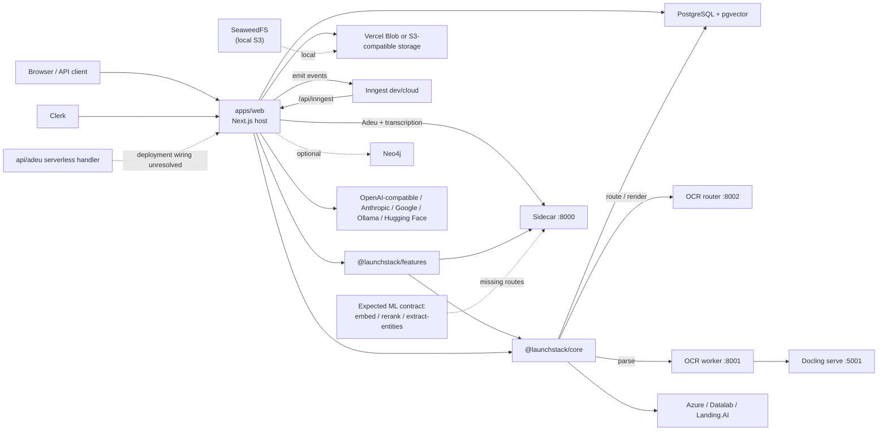

# Current Infrastructure Code Map

**Status:** Current-state inventory  
**Snapshot:** `3dcb60e` (`codex/infrastructure-code-map`)  
**Reviewed:** 2026-07-24

This document maps what is in the repository today. It distinguishes observed
runtime wiring from the intended architecture described elsewhere in the repo.
It is not a proposal to move code.

## Executive summary

Launchstack is in the middle of a monorepo migration:

- The pnpm workspace contains one deployable application, `apps/web`, and two
  TypeScript packages, `packages/core` and `packages/features`.
- Four additional deployable runtimes live outside that workspace:
  `services/ocr-router`, `services/ocr-worker`, `sidecar`, and `api/adeu`.
- Docker Compose adds PostgreSQL/pgvector, SeaweedFS, Inngest, and optionally
  Docling.
- The intended dependency direction is sound—web → features → core—but the
  migration is incomplete. Compatibility shims, direct environment reads, and
  duplicated or stale service contracts still cross those boundaries.
- Most product and infrastructure complexity is concentrated in `apps/web`:
  roughly 106,000 TypeScript/TSX lines, 25 pages, 119 API route handlers, and
  nine Inngest functions at this snapshot.

The repository is therefore best understood as a modular monolith with
auxiliary workers, not as a set of independent application workspaces.

## Repository map

```text
.
├── apps/
│   └── web/                    Next.js host, UI, API/BFF, jobs, adapters
├── packages/
│   ├── core/                   Publishable framework-agnostic engine
│   └── features/               Internal vertical/business capabilities
├── services/
│   ├── ocr-router/             Node/Express OCR classification and PDF rendering
│   └── ocr-worker/             Python/FastAPI proxy to Docling
├── sidecar/                    Python/FastAPI Adeu + Whisper runtime
├── api/
│   └── adeu/                   Standalone Python/Vercel Adeu handler
├── docker/                     Database and SeaweedFS initialization/config
├── docker-compose*.yml         Local/self-hosted topology
├── Dockerfile*                 Web build, migration, and runtime images
├── .github/workflows/          TypeScript CI, web image publish, core release
└── docs/                       Product, deployment, and operations documentation
```

Only `apps/*` and `packages/*` are selected by `pnpm-workspace.yaml`.
`services/ocr-router` has its own `package.json` and npm install; the Python
services have independent requirements files.

## Deployable applications and services

| Path                  | Runtime               | Responsibility                                                                                            | Main entry point                                       | Current deployment path                                                  |
| --------------------- | --------------------- | --------------------------------------------------------------------------------------------------------- | ------------------------------------------------------ | ------------------------------------------------------------------------ |
| `apps/web`            | Next.js 15 / Node 20  | Browser UI, Clerk auth, 119 HTTP API handlers, engine composition, storage adapters, nine background jobs | `src/app`, `src/middleware.ts`, `src/server/engine.ts` | Vercel or root `Dockerfile`                                              |
| `services/ocr-router` | Express / Node 20     | OCR provider routing and PDF page rendering                                                               | `src/server.ts` on `:8002`                             | Its Dockerfile; Compose default stack                                    |
| `services/ocr-worker` | FastAPI / Python 3.12 | Thin `/parse/docling` and `/parse/marker` façade                                                          | `app/main.py` on `:8001`                               | Its Dockerfile; Compose `ocr` profile                                    |
| `sidecar`             | FastAPI / Python 3.12 | DOCX redlining through Adeu and local audio/video transcription through Whisper                           | `app/main.py` on `:8000`                               | Its Dockerfile; Compose default stack                                    |
| `api/adeu`            | Python handler        | Second Adeu/redlining implementation designed for a serverless request shape                              | `index.py`                                             | Intended for Vercel, but not wired by the current `apps/web/vercel.json` |

### Runtime endpoints

| Runtime                 | Implemented endpoints                                                                                                                                      |
| ----------------------- | ---------------------------------------------------------------------------------------------------------------------------------------------------------- |
| OCR router              | `GET /health`, `POST /route`, `POST /render-pages`                                                                                                         |
| OCR worker              | `GET /health`, `POST /parse/docling`, `POST /parse/marker`                                                                                                 |
| Sidecar                 | `GET /health`, `POST /transcribe`, `POST /download-and-transcribe`, Adeu routes `/read`, `/process-batch`, `/accept-all`, `/apply-edits-markdown`, `/diff` |
| Adeu serverless handler | Adeu operations multiplexed by the request path                                                                                                            |

There is an important contract mismatch: TypeScript callers also expect the
sidecar to provide `/embed`, `/rerank`, and `/extract-entities`, but those
routes are not registered by `sidecar/app/main.py`.

## Package boundaries

### `@launchstack/core`

`packages/core` owns the intended portable engine:

- PostgreSQL/Drizzle client and 55 table declarations
- storage, job dispatch, credits, and RAG port interfaces
- ingestion adapters and OCR processing
- embeddings and provider resolution
- graph/Neo4j integration
- guardrails and LLM abstractions

`apps/web/src/server/engine.ts` constructs the engine and supplies concrete
ports for storage, Inngest jobs, credits, and RAG.

The portability boundary is not complete. The package documentation and ESLint
rules say core reads no environment variables, but ten core source files still
contain `process.env` fallbacks. The engine also configures several module-level
slots after construction. Those are migration mechanisms, not the final
dependency model.

### `@launchstack/features`

`packages/features` contains internal vertical capabilities:

- Adeu client
- client prospector
- company metadata extraction
- document ingestion orchestration
- legal templates
- marketing pipeline
- repository explainer
- trend search
- voice/transcription

`connectors`, `mcp`, `rules-extraction`, and `workflow-generation` are currently
roadmap scaffolds. Features may read environment variables, but they may not
import Next.js, Clerk, React, or `apps/web`.

### `apps/web`

The web app is both the product host and the infrastructure composition root.
Its internal layers are:

| Area                                    | Responsibility                                                              |
| --------------------------------------- | --------------------------------------------------------------------------- |
| `src/app`                               | UI pages, layouts, and HTTP route handlers                                  |
| `src/server/engine.ts`                  | Core configuration and singleton lifecycle                                  |
| `src/server/{storage,jobs,credits,rag}` | Host implementations of core ports                                          |
| `src/server/inngest`                    | Background-function registry and implementations                            |
| `src/server/services`                   | Application services for documents/uploads                                  |
| `src/server/notes`                      | Notes and wiki-link domain logic                                            |
| `src/lib`                               | Shared browser/server utilities plus transitional legacy implementations    |
| `src/middleware.ts`                     | Clerk authentication, role routing, workspace routing, and direct DB lookup |

The compatibility layer remains material: 113 web source files still import
the legacy `~/server/db` façade, while 154 import `@launchstack/core` directly.

## Product surface inside `apps/web`

The 25 pages group into these user-facing applications:

| Route family                               | Product surface                                                                                       |
| ------------------------------------------ | ----------------------------------------------------------------------------------------------------- |
| `/`, `/pricing`, `/contact`, `/deployment` | Public marketing and deployment guidance                                                              |
| `/signin`, `/signup`, `/workspaces`        | Identity, registration, and workspace selection                                                       |
| `/employer/*`                              | Employer document workspace, employees, onboarding, metadata, settings, statistics, upload, and tools |
| `/employee/*`                              | Employee home, documents, and approval state                                                          |
| `/employer/tools/marketing-pipeline`       | Marketing workflow UI                                                                                 |
| `/employer/tools/repo-explainer`           | Repository analysis UI                                                                                |

The 119 route handlers group into:

- identity, users, companies, memberships, invite codes, and workspaces
- document upload, storage, versions, notes, graph entities, and retrieval
- document Q&A, predictive analysis, and research agents
- legal document generation and Adeu edits
- OCR configuration, execution, and benchmarking
- company metadata, client prospector, trend search, marketing, and repo explainer
- credits, metrics, health, and Inngest control endpoints
- voice transcription and speech synthesis

This is a broad BFF/API surface inside one deployable application. Route URLs
do not need to change in order to reorganize the implementation behind them.

## Runtime flow



## Background jobs

`apps/web/src/app/api/inngest/route.ts` registers nine functions:

| Function ID                  | Event                                  |
| ---------------------------- | -------------------------------------- |
| `process-document`           | `document/process.requested`           |
| `trend-search-job`           | `trend-search/run.requested`           |
| `client-prospector-job`      | `client-prospector/run.requested`      |
| `extract-company-metadata`   | `company-metadata/extract.requested`   |
| `predictive-analysis-job`    | `predictive-analysis/run.requested`    |
| `reindex-company-embeddings` | `company/reindex-embeddings.requested` |
| `modify-document`            | `document/modify.requested`            |
| `crawl-website`              | `website/crawl.requested`              |
| `rehydrate-note-anchors`     | `notes-anchors/rehydrate.requested`    |

In development, the root `pnpm dev` starts Next.js and an Inngest dev process.
In Docker, a separate Inngest container calls the same API route. In production,
Inngest Cloud is expected to call the Vercel deployment.

## Data and tenancy

- Drizzle table declarations live under `packages/core/src/db/schema`.
- SQL migration files and migration scripts live under `apps/web/drizzle` and
  `apps/web/scripts`.
- The primary database is PostgreSQL with pgvector.
- Tenant ownership is mostly represented by `companyId`; current workspace
  selection also uses `userCompanyMemberships`.
- Clerk owns authentication. Middleware reads PostgreSQL directly to enforce
  employer/employee routing and workspace selection.
- Object storage is selected at runtime: Vercel Blob, S3-compatible storage, or
  a database fallback. Docker uses SeaweedFS as the S3-compatible implementation.
- Neo4j is optional for graph retrieval; PostgreSQL also stores knowledge-graph
  entities, mentions, and relationships.

## Deployment modes

| Mode                 | Components                                                                        | Notes                                                                                                      |
| -------------------- | --------------------------------------------------------------------------------- | ---------------------------------------------------------------------------------------------------------- |
| Local pnpm           | Next.js + Inngest dev; externally supplied PostgreSQL and optional services       | Fastest web development loop                                                                               |
| Docker default       | PostgreSQL, migration target, SeaweedFS, sidecar, OCR router, web, Inngest        | The sidecar and OCR router are hard startup dependencies even though documentation calls sidecars optional |
| Docker `ocr` profile | Default stack + OCR worker + Docling serve                                        | Adds the heavier self-hosted Office/OCR path                                                               |
| Vercel               | Next.js functions + managed PostgreSQL/storage + Inngest Cloud; sidecars external | Current config location and documentation disagree about the Vercel project root                           |
| Core package release | `@launchstack/core` built and published to npm                                    | Handled by Changesets on `main`                                                                            |

The Docker `migrate` target runs `db:push` plus a backfill; the Vercel production
build runs the forward SQL migration script. Those are two different schema
application strategies.

## CI/CD coverage

| Workflow      | Covered                                                                                       | Not covered                                              |
| ------------- | --------------------------------------------------------------------------------------------- | -------------------------------------------------------- |
| `CI.yml`      | Workspace install, DB schema push, root lint/typecheck, web Jest tests, web build, core build | OCR router build/tests and all Python services           |
| `docker.yml`  | Root web Dockerfile build and GHCR publish                                                    | Sidecar, OCR router, OCR worker, and Compose integration |
| `release.yml` | Core package build, pack validation, Changesets publication                                   | Features package and application/service releases        |

Next.js itself has `ignoreBuildErrors` and `ignoreDuringBuilds` enabled, so
deploy correctness depends on the separate CI workflow being required.

## Current sources of confusion and risk

| Finding                                              | Why it matters                                                                                                               |
| ---------------------------------------------------- | ---------------------------------------------------------------------------------------------------------------------------- |
| Workspace boundary is incomplete                     | Deployable services do not participate in the same install, typecheck, test, or release graph                                |
| Core still has environment fallbacks                 | The published package's documented portability contract is not yet true for every path                                       |
| Web contains legacy and new implementations          | Callers can choose multiple DB, RAG, LLM, OCR, and job access paths                                                          |
| Sidecar implementation and callers disagree          | Configuring sidecar reranking, embeddings, or NER can call endpoints that do not exist                                       |
| Two Adeu runtimes exist                              | Ownership, behavior parity, authentication, and deployment target are unclear                                                |
| Vercel root is ambiguous                             | Config moved to `apps/web/vercel.json`, while deployment docs still require repo root `./` and link to a removed root config |
| Database schema ownership is split                   | Core declares schema; web owns migration files; Docker and Vercel apply schema differently                                   |
| “Optional” services are mandatory in default Compose | Local startup cost and failure modes are larger than the documentation implies                                               |
| Floating container/dependency versions               | `latest` images and broadly ranged Python packages reduce reproducibility                                                    |
| API surface is concentrated in one directory         | 119 handlers make ownership, authorization consistency, and testing harder to see                                            |
| Documentation reflects multiple eras                 | `docs/Architechture`, old `src/*` paths, and incorrect `services/sidecar` references obscure the actual code                 |

## What is intentionally not inferred

This inventory does not decide:

- whether the serverless or container Adeu implementation is used in production
- whether missing sidecar ML endpoints were removed intentionally
- whether Vercel currently uses repo root or `apps/web` as its configured root
- whether every route consistently enforces company/workspace scoping

Those require production configuration or an explicit product/operations
decision. The cleanup ADR treats them as early verification tasks.
