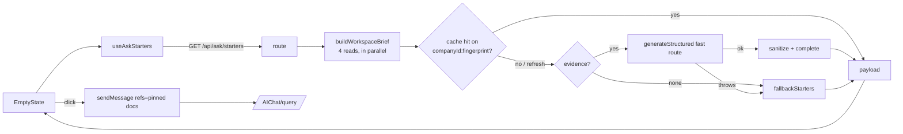

# Technical Design

**Feature** Ask starters — the four question cards on the workspace home ·
**Author** Deodat-Lawson (drafted with Claude Code) · **Date** 2026-09-02 ·
**Status** Draft · **Brief** _none — a direct product request; see §9_

---

## 1 Summary

The first screen of the workspace (`/employer/documents`) shows four question
cards under "What do you want to ask yourself?". Today they are hard-coded
strings that mention sources the workspace does not have ("from Gmail + pitch
deck", "from GitHub") and have no click handler. The most prominent controls on
the home screen are decorative.

This design makes the cards do three things:

1. **Work.** Clicking a card sends its question through the same path as a
   typed message. When the question is about specific documents, those
   documents are pinned as sources first, so the answer — and any follow-up —
   is scoped to them.
2. **Fit the company.** A new route writes the four questions from what the
   workspace actually holds: the company row from signup, the extracted company
   profile (services, projects, customers, contracts, policies), the folders and
   newest documents, and the connected systems. A deterministic set covers the
   cases where there is no model, the model fails, or there is nothing to ground
   a question in.
3. **Cost one call per change.** The set is cached per workspace on a
   fingerprint of the evidence, so a page load is one round trip and a model
   call only happens when something new was uploaded, extracted, or connected —
   or when the user asks for a different set.

**Ship target** One PR; no migration, no new configuration.

---

## 2 Context and constraints

**Builds on**

- `AskPanel` → `EmptyState` (`apps/web/src/app/employer/documents/_workspace/AskPanel.tsx`)
  — renders the empty thread. `WorkspaceShell.sendMessage(ComposerSend)` is
  the one send path; it scopes the query (document / selected / company) from
  the pinned refs and calls `/api/agents/documentQ&A/AIChat/query`.
- `company_metadata` — the extracted company profile (`@launchstack/tools/company-context`
  owns the schema, `formatMetadataContext` and the `readFact` confidence gate:
  active facts at ≥ 0.5 only). Extraction is manual today (Settings → Company
  profile → Extract).
- `generateStructured` (`~/lib/llm`) — a zod-typed call on the operator's
  `fast` route with one repair attempt; the same helper metadata extraction
  uses.
- `createTtlCache` (`@launchstack/tools/web-research`) — the shared in-memory
  TTL cache.
- `requireWorkspaceContext`, `withRateLimit`, `~/server/api/responses` — the
  route conventions.
- The design system: kit primitives from `~/components/ui`, tokens, lucide
  icons; touch-it-migrate-it for the region of `AskPanel` being edited.

**Not changing**

- The query route, retrieval, guardrails, or metering. A starter is an ordinary
  question by the time it reaches the server.
- The composer and its per-turn toggles (web search, thinking). A starter sends
  with whatever the user has set.
- The extraction pipeline. Starters read the profile; they never trigger it.
- The database. No table, no migration; the cache is per process.

---

## 3 Architecture / Design

### 3.1 The brief — what a starter may be grounded in

| Signal              | Source                                                                            | Why it is in                                                                                       | Shape in the prompt                                          |
| ------------------- | --------------------------------------------------------------------------------- | -------------------------------------------------------------------------------------------------- | ------------------------------------------------------------ |
| Company identity    | `company` row (signup)                                                            | Present for every workspace from day one                                                           | name, industry, size, description                            |
| Company profile     | `company_metadata` JSONB, formatted by `formatMetadataContext`                    | The one place "what the company does and its operations" is already extracted and confidence-gated | services, projects, people, markets, policies (≤ 3000 chars) |
| Knowledge inventory | `document` table: count per `category`, newest 16 titles with ids and ages, total | What the workspace can actually answer from                                                        | folders with counts; `id · title · folder · added` lines     |
| Connections         | `connector_connections` with `status = active`                                    | Says which systems feed the workspace (Drive, Slack, GitHub)                                       | provider names                                               |

Deliberately **not** in the brief:

- **Chat history.** `chat_history` rows are per user, and only document-scoped
  questions are recorded. Using them would make the set per user (privacy) and
  multiply model calls by headcount. Deferred — see §9.
- **Retrieval snippets.** A RAG pass per page load would be the most expensive
  thing on the screen, and starters are about what the workspace _has_, not any
  one passage. The answer is where retrieval belongs.

The brief's **fingerprint** is `total:maxDocumentId:profileUpdatedAt:connections`.
Any upload, deletion, re-extraction, or new connection changes it.

### 3.2 The prompt contract

The system prompt (`STARTERS_SYSTEM_PROMPT`) asks for exactly four questions,
8–14 words, one of each shape — broad across sources; about one named recent
document; about the company's operations as evidenced; looking for change,
risk, or gaps — grounded only in the evidence, with a 3–7 word hint saying
where the answer will come from. `documentIds` may only name ids from the
recent-documents list.

The model's output (`GeneratedStartersSchema`) is looser than the wire shape
on purpose: 1–8 items. Every field in it is **required** — a broad question
carries an empty `documentIds` array — because endpoints that enforce the
schema natively (OpenAI-compatible json-schema mode, which the configured Gemini
route uses) reject `.optional()` outright, and the rejection surfaces as a failed
call. The first real run against the local stack found exactly that: every call
fell through to the fallback until the field was made required.
`sanitizeStarters` then

- strips numbering and wrapping quotes, caps lengths, drops fragments, and
  rewrites quoted document titles without their file extension;
- drops any `documentId` not in the brief and caps pins at two;
- dedupes on a punctuation- and case-insensitive key;
- keeps the first four.

`completeStarters` pads a short set from the fallback list without repeating a
question. The client never receives a pin it cannot resolve.

### 3.3 The fallback

`fallbackStarters(brief)` is deterministic and still reads as this workspace's:
"Summarize _newest title_" (pinned), "What are the key dates and deadlines in
_largest folder_?", "What does _company_ do, according to these sources?",
"What are the main points of _second title_?" (pinned), then generic themes.
It is used when the workspace has no evidence at all (no sources, no profile,
no description — the model is not called), when the model is unconfigured, or
when the call throws.

### 3.4 Cache and Shuffle

`getAskStarters` caches the payload under `companyId:fingerprint` for 12 hours
(bounded at 2000 entries). `refresh=1` skips the read, hands the cached
questions to the model as an "already shown — write different questions" block,
and overwrites the entry. Because a refresh always costs a model call, the
route puts it behind `RateLimitPresets.burst` (10/min) instead of `standard`.

### 3.5 The client

- `useAskStarters(revisionKey)` — fetches on mount and whenever the key
  (workspace name + source count) changes; keeps the last payload per key in
  module scope so "New chat" repaints the same cards instantly; aborts on
  unmount; exposes `refresh()`.
- `AskStarters` — the cards, from `Button` (outline) and tokens. Skeleton
  while loading, an offline set of four generic-but-sendable questions if the
  route is unreachable, a basis line ("Suggested from the Acme profile and 42
  sources"), a Shuffle button, and an "Add company profile" nudge (→ Settings →
  Company) when no profile informed the set.
- `AskPanel` — `handleAskStarter(starter, refs)`: pinned refs replace the
  selection and become the send's refs; a broad starter sends over whatever the
  user already pinned. `EmptyState` is converted to kit + tokens in the same
  edit.

### 3.6 Files

| File                                           | Role                                                                    |
| ---------------------------------------------- | ----------------------------------------------------------------------- |
| `apps/web/src/lib/ask-starters/contract.ts`    | Wire types + the model output schema (shared, no server imports)        |
| `apps/web/src/server/ask-starters/starters.ts` | Pure: prompt, sanitize, complete, fallback, helpers                     |
| `apps/web/src/server/ask-starters/brief.ts`    | IO: the four reads → `WorkspaceBrief`                                   |
| `apps/web/src/server/ask-starters/index.ts`    | Cache + model call + fallback → payload                                 |
| `apps/web/src/app/api/ask/starters/route.ts`   | `GET`, auth, limiter tier, error hygiene                                |
| `…/_workspace/useAskStarters.ts`               | Client hook                                                             |
| `…/_workspace/AskStarters.tsx`                 | The cards                                                               |
| `…/_workspace/AskPanel.tsx`                    | `EmptyState` rewrite + `handleAskStarter`                               |
| `apps/web/src/app/dev/ask-starters/`           | Auth-free harness (`?slow=1`, `?fail=1`, `?fallback=1`, `?noprofile=1`) |

---

## 4 Impacts

**Graph changes** None.

**Provider interfaces touched** None. The model call goes through
`generateStructured`, i.e. the operator's `fast` route; an operator who has not
configured one gets the fallback set, not an error.

**Public surface**

- New: `GET /api/ask/starters[?refresh=1]` — any verified member; returns
  `{ success, data: { starters, basis } }`.
- New (non-production): `/dev/ask-starters`.
- No env vars, no config file changes, no schema.

**External services, and how they fail**

| Service                   | When it is down or misconfigured                           | Behaviour                                                                                                                              |
| ------------------------- | ---------------------------------------------------------- | -------------------------------------------------------------------------------------------------------------------------------------- |
| Chat model (`fast` route) | Unconfigured, unreachable, rate-limited, unrepairable JSON | `generateStructured` throws; the route returns the fallback set with `mode: "fallback"` and logs a warning. The screen looks the same. |
| Postgres                  | Unreachable                                                | The route 500s (`"Request failed"`, no driver text); the client shows the offline set, which still sends.                              |

**Background jobs** None. Nothing is queued; nothing runs after the response.

**Credits** The call is not debited, matching metadata extraction, which uses
the same helper. See §9.

---

## 5 Alternatives considered

| Option                                                                                    | Why it was rejected                                                                                                                                                  | What would change our mind                                                                                |
| ----------------------------------------------------------------------------------------- | -------------------------------------------------------------------------------------------------------------------------------------------------------------------- | --------------------------------------------------------------------------------------------------------- |
| **Keep the static four, just wire the clicks**                                            | Fixes the broken promise but keeps the wrong one: the cards name Gmail and GitHub sources most workspaces do not have.                                               | Never — the relevance ask is explicit.                                                                    |
| **Templates only, no model** (fill "Summarize {title}" style patterns from the inventory) | This is the fallback, and it ships. As the only path it cannot ask about _operations_ — customers, renewals, policies — which is what the profile makes possible.    | A deployment policy of zero model calls outside chat; then set the fallback as the only path with a flag. |
| **Ground starters in retrieval** (a RAG pass per load)                                    | The most expensive thing on the screen, for questions rather than answers. Titles and the profile carry enough to write good questions.                              | Evidence that profile + titles produce weak questions for real workspaces.                                |
| **Per-user starters from chat history**                                                   | Per-user cache multiplies cost by headcount; company-scope questions are not persisted today; surfacing colleagues' questions is a privacy decision nobody has made. | Persisting company-scope questions, and a decision that "asked before" is wanted.                         |
| **Persist the set in a table**                                                            | A migration and a write path for something a 12-hour per-process cache already covers at current scale (one app container).                                          | A multi-instance app tier, where each instance would regenerate.                                          |
| **Do nothing**                                                                            | The home screen's largest controls stay decorative.                                                                                                                  | —                                                                                                         |

---

## 6 Failure modes

| What breaks                                                                 | Blast radius                                                                                                                                                                                                         | How we detect it                                                                                           | Fallback                         |
| --------------------------------------------------------------------------- | -------------------------------------------------------------------------------------------------------------------------------------------------------------------------------------------------------------------- | ---------------------------------------------------------------------------------------------------------- | -------------------------------- |
| **Venue network blocks outbound calls**                                     | Reframed: the deployment has no egress to the model provider. Starters degrade to the deterministic set; chat itself is the bigger casualty.                                                                         | `[ask-starters] generation failed` warnings; `basis.mode: "fallback"` in responses.                        | The fallback set, automatically. |
| **Event page or rules change format mid-event**                             | Not applicable — nothing third-party is parsed.                                                                                                                                                                      | —                                                                                                          | —                                |
| **Repo is private, enormous, or barely committed**                          | Not applicable.                                                                                                                                                                                                      | —                                                                                                          | —                                |
| **Upload fails, or the video lands private**                                | Not applicable — starters never upload. A failed upload simply never enters the inventory.                                                                                                                           | —                                                                                                          | —                                |
| **Model names a document, customer, or system that is not in the evidence** | One misleading card; the question is shown before it is sent, and sending it yields a grounded "not found" answer. Pins to unknown ids are dropped server-side.                                                      | Unit tests pin the id filter; spot-check `basis.mode` and questions in the harness and in production logs. | Shuffle.                         |
| **Model is slow** (the `fast` route resolves to a large model)              | The cards show a skeleton; the composer is usable throughout. `maxDuration` is 60s.                                                                                                                                  | `[llm] generateStructured ok … Nms` per call.                                                              | The user types instead.          |
| **Stale set after an upload or extraction**                                 | Cards ignore the new document until the fingerprint changes — it changes on the next read, since it is computed from the same reads.                                                                                 | Fingerprint carries `maxDocumentId` and `profileUpdatedAt`.                                                | Shuffle.                         |
| **Prompt injection through a document title**                               | A title can steer the model's _questions_, not any answer: the model's only output is four questions, they are shown before they are sent, and the sent question then goes through the query route's own guardrails. | Review of generated questions in the harness; the route logs the model id.                                 | Rename the document.             |
| **Shuffle abuse**                                                           | One model call per click.                                                                                                                                                                                            | Burst limiter (10/min per client), and the button disables while a request is in flight.                   | The limiter's 429.               |
| **Cache growth**                                                            | Bounded: 2000 entries, 12-hour TTL, one entry per workspace per fingerprint.                                                                                                                                         | —                                                                                                          | Pruned on write.                 |
| **Information exposure**                                                    | The set is company-scoped and built only from data every member can already open (documents, the Company profile page, connections). No user-level data enters the brief or the cache key.                           | Structural — `buildWorkspaceBrief` takes only `companyId`.                                                 | —                                |

**The worst thing this can do to a team** A member of a workspace sees a card
that names a customer or a contract from the extracted profile they had not
noticed before. That is the same fact the Company profile page already shows
every member; the card makes it findable, which is the point.

---

## 7 Verification

**Automated**

- `__tests__/server/ask-starters/starters.test.ts` — the rules: unknown ids
  dropped and pins capped at two; numbering stripped and near-duplicates
  removed; fragments discarded; a short set padded without repeating; the
  fallback names the newest document, largest folder and company, and still
  yields four for an empty workspace; the prompt lists the evidence and the
  avoid list.
- `__tests__/api/ask-starters.route.test.ts` — auth failure passes through;
  the standard limiter on a plain load and the burst limiter on `refresh=1`;
  a generator failure never leaks its message.
- `_workspace/__tests__/AskPanel.starters.test.tsx` — the four fetched
  questions and the basis line render; a pinned starter pins and sends over its
  document; a broad starter keeps the user's pins; a pin to a deleted document
  is dropped; cards wait while a message is in flight; Shuffle calls
  `?refresh=1`; the offline set still sends; the profile nudge opens Settings.

**End-to-end dry run** Two runs were performed on 2026-09-02.

- `/dev/ask-starters` mounts the real `AskPanel` with the two session-guarded
  routes stubbed: load → skeleton → four cards → click → user turn with the
  pinned source chip → reply with a citation. The slow, offline, fallback and
  no-profile flags were each screenshotted, in both themes.
- `getAskStarters` was run from a script against the local Postgres and the
  deployment's configured `fast` route (`google/gemini-3.5-flash-lite`): the
  one-document workspace produced four generated questions in 1.5 s, the second
  call was a 6 ms cache hit, `refresh` returned a different four in 1.1 s, and
  a synthetic brief with a company profile produced questions naming the
  Globex MSA, the Initech pilot's pick-rate result, and missing compliance
  exhibits in Contracts — the operations signal the profile is there to supply.

**The check that catches the worst failure in §6** There is no user-level
input to leak: `buildWorkspaceBrief(companyId)` is the only read path, and the
route test pins that the cache key is the company id plus the evidence
fingerprint. The exposure surface is the existing one.

**Instrumentation** `generateStructured` already logs
`capability=smallExtraction … model=… Nms` per call; starters carry
`schemaName: ask_starters`. The route warns `[ask-starters] generation failed`
on every fallback, and `basis.mode` in the response says which path produced
the set.

---

## 8 Team assignment (after approval)

Single PR; no parallel workstreams.

---

## 9 Open questions

| Question                                                                                                                                                                                                                | Who decides            | By when                           |
| ----------------------------------------------------------------------------------------------------------------------------------------------------------------------------------------------------------------------- | ---------------------- | --------------------------------- |
| This doc has no brief; the request was made directly. Is that sufficient for a UI change of this size?                                                                                                                  | Repository maintainers | Before merge                      |
| Should the starter call debit credits? Today it follows metadata extraction (not debited). At one call per workspace per evidence change the cost is small, but it is a model call a member did not explicitly ask for. | Deodat-Lawson          | Before the hosted instance meters |
| Company-scope questions are not persisted, so "asked before" cannot be a signal. Persist them (`chat_history` is document-keyed and per user), and if so, may a colleague's question surface as a starter?              | Deodat-Lawson          | When the usage signal is wanted   |
| Profile extraction is manual. Should a workspace's first extraction run automatically once N documents exist, so starters get the operations signal without a Settings visit?                                           | Repository maintainers | Separate design                   |
| If the app tier becomes multi-instance, the per-process cache regenerates once per instance. Move to a table then?                                                                                                      | Repository maintainers | When that happens                 |
