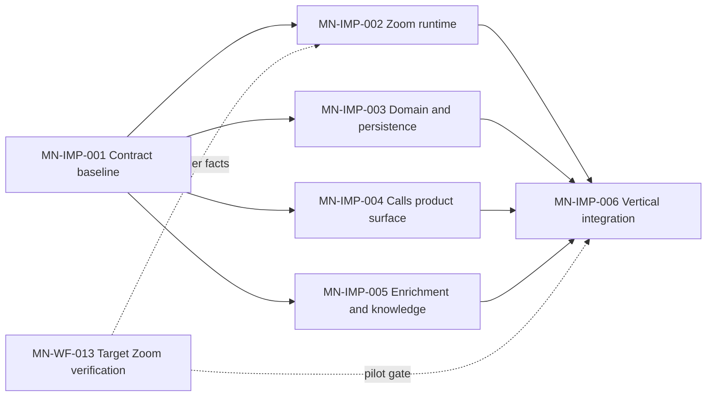

# Implement Call Notes Zoom-First Vertical Slice

## Outcome

A production Call Notes feature for one self-hosted LaunchStack deployment: an authorized user can capture a Zoom occurrence, see an attributed live Transcript with honest gaps, write one owner-controlled Call Note, review a post-call AI proposal, and deliberately include the accepted canonical note in company knowledge.

## Delivery graph

MN-IMP-003, MN-IMP-004, and MN-IMP-005 may proceed against the deterministic contract fixtures while target-account Zoom verification remains open. MN-IMP-002 may implement everything supported by the settled official contract, but pilot acceptance remains blocked on MN-WF-013 evidence.

## Shared baseline

The canonical contract pack is `@launchstack/features/call-notes`:

- `contracts.ts`: commands, normalized capture events, snapshots, enrichment payloads, and knowledge output.
- `ports.ts`: capture source, application, model, knowledge sink, clock, and ID boundaries.
- `schema.ts` plus the product migrations: shared persistence contract.
- `testing.ts`: deterministic Zoom timeline, capture-source conformance, and simulated vertical tracer.
- `apps/web/__tests__/callNotes/contracts.test.ts`: focused behavior checks for the frozen contract.

Architecture decisions remain in `docs/issues/call-notes-wayfinder/001` through `014`. The prototype is interaction evidence, not production code.

## Ownership and collision rules

| Lane                     | Owner      | Exclusive surface                                                                                                         |
| ------------------------ | ---------- | ------------------------------------------------------------------------------------------------------------------------- |
| Contract and integration | Kien       | Canonical contracts, schema/migration, fixtures, package exports, root environment/Compose wiring, final cross-lane fixes |
| Zoom integration         | Kien       | `apps/call-worker/**`; web OAuth/callback/signed-webhook edge; provider adapter                                           |
| Domain and persistence   | Teammate-1 | Call/Capture services, repositories, authorization, commands, state transitions, product API handlers                     |
| Product surface          | Teammate-2 | Production Calls pages/components/client behavior and their UI tests                                                      |
| Enrichment and knowledge | Teammate-3 | Enrichment generation, provenance/revisions, knowledge sink and retrieval integration                                     |

A lane may consume another lane's public interface but must not edit its exclusive surface. Teammates do not edit canonical contracts, schema/migration, root exports, environment parsing, Docker/worker wiring, or another lane's files. Kien resolves shared wiring and integration conflicts.

## Contract-change protocol

A discovered mismatch blocks only the affected seam. The owner reports the failing scenario and proposes the smallest contract change; no lane adds a local duplicate type, optional escape hatch, compatibility shim, or workaround. Kien updates the canonical contract, migration/fixture if needed, and conformance expectation. Affected lanes then consume the revised baseline.

## Independent handback

Each lane returns an integration-ready branch/worktree containing:

- the public interfaces and owned artifacts it completed;
- focused behavior and shared-conformance results;
- the owned files changed;
- unresolved contract requests;
- operational assumptions or known failures.

Lane owners do not merge, edit root wiring, or integrate other lanes.

## Epic acceptance

- The production state path is `Zoom -> normalized capture events -> Call/Capture persistence -> product APIs -> Calls UI -> enrichment proposal -> accepted Call Note -> knowledge sink`.
- The shared vertical tracer passes through the real domain state machine, PostgreSQL repositories, API handlers, and production UI with only Zoom transport and model output faked.
- One real Zoom meeting proves that the adapter emits the normalized events exercised by the deterministic fixture.
- One configured model smoke proves the enrichment schema; deterministic model fixtures remain the correctness oracle.
- Replayed provider events do not duplicate Transcript segments, work, or Calls.
- Pause, reconnect, same-user return, partial finalization, private-note isolation, owner-only edits, deletion, and knowledge include/remove behavior are proven.
- Self-hosted Docker and Vercel-plus-private-worker modes use the same application contract and normal LaunchStack public HTTPS origin.
- Pilot enablement remains fail-closed until MN-WF-013 supplies the verified concurrency, rate, Pause billing, reconnect, and continuation facts.

## Non-goals

Google Meet or native capture, raw-media retention, custom streaming ASR, live copilot behavior, transcript editing, cross-user capture handoff, centralized OAuth/SaaS operation, automatic company-wide indexing, and a second knowledge system.
