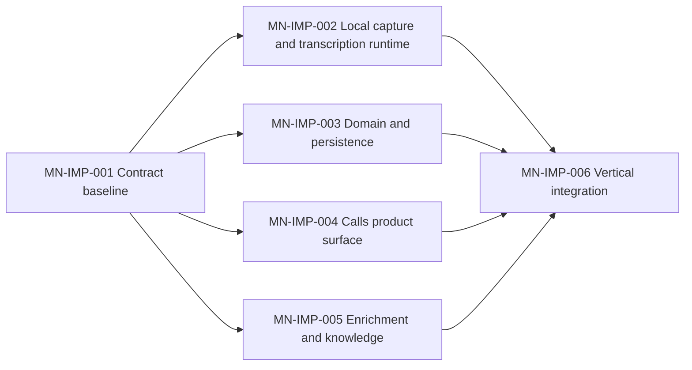

# Implement Call Notes Local-Audio Vertical Slice

## Outcome

A production Call Notes feature for one self-hosted LaunchStack deployment: an authenticated same-company user can start local microphone and computer-audio capture, see immutable derived ASR transcript evidence with required channel provenance and honest gaps, write one owner-controlled Call Note, review a post-call AI proposal, and deliberately include the accepted canonical note in company knowledge.

The full host path captures the local microphone and the computer's combined system output as independent channels. Docker/Linux is an explicit microphone-only development fallback because Docker Desktop cannot expose macOS system audio; neither mode promises complete conversation coverage, diarization, or speaker attribution. No meeting bot joins, and raw audio is never retained as a recording.

## Delivery graph

```mermaid
flowchart LR
    C[MN-IMP-001 Contract baseline] --> R[MN-IMP-002 Local capture and transcription runtime]
    C --> D[MN-IMP-003 Domain and persistence]
    C --> U[MN-IMP-004 Calls product surface]
    C --> A[MN-IMP-005 Enrichment and knowledge]
    R --> I[MN-IMP-006 Vertical integration]
    D --> I
    U --> I
    A --> I
```

All lanes consume the `call-notes/v2` contract and its deterministic dual-channel local-audio fixtures. No external conferencing account or service gate blocks implementation. A configured cloud Transcription Model smoke is operational evidence only; deterministic audio, event, and model fixtures remain the correctness oracle.

## Team alignment

The implementation uses the normalized `local_audio` source, independent microphone and system-output streams, per-channel Voice Activity boundaries, cloud transcription, immutable derived ASR evidence with channel provenance, transcript finalization, synthetic-fixture parallelism, a reviewable AI proposal, and deliberate knowledge acceptance.

Kien owns local capture/transcription, canonical contract approval, and final release integration. Junkun leads day-to-day implementation and owns enrichment/knowledge. Hank owns the Calls product surface. Peace owns domain/persistence, transcript finalization, shared fixture integration, and the E2E harness. Delivery evidence is the deterministic fixture E2E, local worker smoke, configured transcription-model smoke, and knowledge integration.

## Shared baseline

The canonical contract pack is `@launchstack/pipelines/call-notes`:

- `contracts.ts`: commands, source-normalized capture events, snapshots, enrichment payloads, and knowledge output.
- `ports.ts`: local capture source, application, model, knowledge sink, clock, and ID boundaries.
- `schema.ts` plus the product migrations: shared persistence contract.
- `testing.ts`: deterministic microphone and system-output timelines, channel-tagged Audio Utterances, capture-source conformance, and simulated vertical tracer.
- `apps/web/__tests__/callNotes/contracts.test.ts`: focused behavior checks for the v2 contract.

The prototype is interaction evidence, not production code.

## Ownership and collision rules

| Lane                            | Owner  | Exclusive surface                                                                                                                                                      |
| ------------------------------- | ------ | ---------------------------------------------------------------------------------------------------------------------------------------------------------------------- |
| Contract and final release      | Kien   | Canonical contracts, schema/migration, fixtures, package exports, root environment/Compose wiring, protected internal-route wiring, final cross-lane fixes             |
| Local capture and transcription | Kien   | `apps/call-worker/**`; dual local audio sources, per-channel Voice Activity, PCM/WAV handling, cloud Transcription Model integration, and worker-to-application client |
| Domain and persistence          | Peace  | Call/Capture services, repositories, transcript finalization, fixture/E2E harness, and product API handlers                                                            |
| Product surface                 | Hank   | Production Calls pages/components/client behavior and their UI tests                                                                                                   |
| Enrichment and knowledge        | Junkun | Enrichment generation, provenance/revisions, knowledge sink and retrieval integration                                                                                  |

A lane may consume another lane's public interface but must not edit its exclusive surface. Teammates do not edit canonical contracts, schema/migration, root exports, environment parsing, Docker/worker wiring, or another lane's files. The web ingress lane owns implementation of the protected local-worker route; contract and release ownership owns its root wiring and secret configuration. Contract and release ownership resolves final wiring and integration conflicts.

## Contract-change protocol

A discovered mismatch blocks only the affected seam. The owner reports the failing scenario and proposes the smallest contract change; no lane adds a local duplicate type, optional escape hatch, compatibility shim, or workaround. Kien updates the canonical contract, migration/fixture if needed, and conformance expectation. Affected lanes then consume the revised baseline.

## Independent handback

Each lane returns an integration-ready branch/worktree containing:

- the public interfaces and owned artifacts it completed;
- focused behavior and shared-conformance results;
- deterministic dual-channel local-audio/model evidence where applicable;
- the owned files changed;
- unresolved contract requests;
- operational assumptions or known failures.

Lane owners do not merge, edit root wiring, or integrate other lanes.

## Epic acceptance

- The production state path is `local microphone + computer audio -> Local Capture Worker (two tagged streams) -> per-channel Voice Activity and Audio Utterances -> cloud Transcription Model -> channel-provenance `derived_asr` CaptureEvents -> Call/Capture persistence -> product APIs -> Calls UI -> enrichment proposal -> accepted Call Note -> knowledge sink`.
- The shared vertical tracer passes through the real domain state machine, PostgreSQL repositories, API handlers, and production UI with deterministic microphone/system-output audio and transcription fixtures plus a recording knowledge sink.
- A local worker smoke proves the expected event order: `attempt_connected`, channel-tagged `transcript_segment` events with `sourceKind: "derived_asr"` and `participant: null`, `attempt_ended` with `reason: "silence_timeout"` after both channels end, `occurrence_ended`, then `finish`.
- A configured Transcription Model smoke confirms request/response and output-schema compatibility only. It does not prove complete remote-party or system-audio coverage, complete conversation capture, diarization, or speaker attribution.
- Replayed or out-of-order source events do not duplicate Transcript segments, durable work, or Calls. Source identity uses `source`, `sourceOccurrenceKey`, `sourceAttemptKey`, and related source keys.
- User-stopped and source-stopped attempts, silence timeout, partial finalization, private-note isolation, owner-only edits, deletion, stale enrichment acceptance, and knowledge include/remove behavior are proven.
- Self-hosted Docker starts web, PostgreSQL, and one private microphone-only Local Capture Worker behind the normal LaunchStack HTTPS origin. Full dual-channel capture runs the worker on a macOS 14+ host; Vercel plus a privately hosted supported host uses the same protected internal route and contract.
- The internal worker wire is `POST /api/internal/call-notes/local` with `Bearer CALL_NOTES_INTERNAL_TOKEN`; `start`, `event`, and `finish` requests preserve company scope and the authenticated `captureUserId`.
- Operational health identifies web, database, worker, transcription failures, active attempts, stuck work, and failed finalization without a public worker endpoint or a new queue.
- Every authenticated same-company user may start local audio capture without connecting an external identity. Persistence stores `captureUserId`; no source connection credentials or raw audio are exposed in Call Notes snapshots.
- No duplicate contract types, compatibility shims, stale prototype routes in production navigation, or external-service configuration remain.

## Non-goals

Conferencing-service capture, meeting bots, browser capture, per-app system-audio capture, guaranteed remote-party audio, complete meeting recording, diarization or speaker attribution, raw-media retention, custom streaming ASR, live copilot behavior, transcript editing, cross-user capture handoff, overlapping Attempts, centralized hosted/SaaS operation, automatic company-wide indexing, and a second knowledge system are not part of v2.
