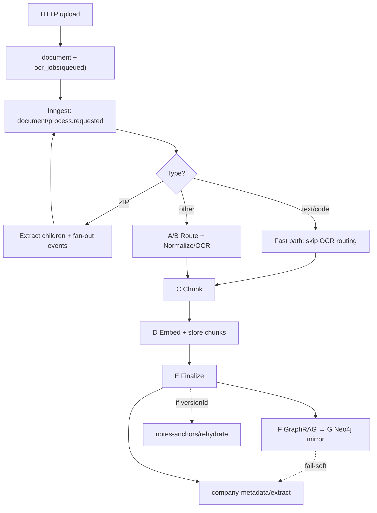

# Document Ingestion Pipeline

> Grounded in `main` as of 2026-07-19. 

---

## 1. Summary

A document is uploaded over HTTP, recorded as a `document` + `ocr_jobs(queued)` row, and
an Inngest event `document/process.requested` is dispatched. One durable function
(`process-document`) runs stages **A → G** inline as memoized steps: route → OCR → chunk →
embed/store → finalize → GraphRAG extract (Postgres) → Neo4j mirror. On success it chains
`company-metadata/extract.requested` (and, when re-processing a version,
`notes-anchors/rehydrate.requested`). ZIP uploads fan out into child documents; text/code
files take a fast path that skips OCR routing.

**Stores:** Postgres + pgvector (relational, vectors, graph source of truth), Neo4j (graph
mirror), object storage (raw bytes).

---

## 2. Where the code lives

```
HTTP upload          apps/web  …/api/uploadDocument + document-upload.ts
       ↓
Inngest dispatch     packages/core  …/ocr/trigger.ts
       ↓
process-document     apps/web  …/inngest/functions/processDocument.ts
       ↓
runDocIngestionTool  packages/features  …/doc-ingestion/index.ts   ← stages A–G
       ↓
OCR / embed / graph  packages/core  …/ocr/processor.ts, …/graph/, …/ingestion/
```

---

## 3. Flow



### Stages (A → G)

Orchestrator: [`runDocIngestionTool`](../../packages/features/src/doc-ingestion/index.ts).
Each `runStep` becomes an Inngest `step.run` (memoized on retry).

| Step | What | Writes |
|------|------|--------|
| Upload / dispatch | HTTP + Inngest event | `document`, `document_versions`, `ocr_jobs(queued)` |
| **A** Route | Pick OCR path (SigLIP optional) | — |
| **B** Normalize / OCR | Azure / Landing.AI / Datalab / OSS / pdfjs; VLM enrichment | pages → `ocr_jobs.ocrResult` |
| **C** Chunk | Parent/child text units | chunks → `ocr_jobs.ocrResult` |
| **D** Embed / store | OpenAI 1536-dim **or** sidecar `/embed` | `document_structure`, `document_context_chunks`, `document_retrieval_chunks` |
| **E** Finalize | Mark success | `document_metadata`; `ocrProcessed=true`; `ocr_jobs.status=completed` |
| **F** GraphRAG | Entities + relationships (one step) | Postgres `kg_*` |
| **G** Neo4j sync | Mirror from `kg_*` | `:Entity` / `:Section` + edges |
| Downstream | Separate Inngest fns | `company_metadata`; note-anchor rehydrate |

**A/B in code:** Azure PDFs use `step-a-router` + `step-b-normalize`; everything else uses one
`step-ab-ingest` step. There is no separate “F2” — entities and relationships are extracted
together.

**Branches** ([`processDocument.ts`](../../apps/web/src/server/inngest/functions/processDocument.ts)):

- **ZIP** — extract entries (cap 500, 10 MB/file), insert child docs + jobs, fan out events in
  batches of 10, delete the original ZIP doc. Child `putFile` bypasses the storage facade
  (imports Vercel Blob directly) — a known footgun.
- **Text fast-path** — mime/extension skip OCR (`fastTextPath: true`) → chunk/embed onward.

**Inngest config:** `retries: 5`, concurrency 3, throttle 30/min, finish timeout 120m, plus
`onFailure`.

---

## 4. What gets written

| Store | Pipeline tables / artifacts |
|-------|-----------------------------|
| **Postgres** | `document`, `ocr_jobs` (job + scratch state in `ocrResult`), `document_structure`, `document_context_chunks`, `document_retrieval_chunks` (`vector(1536)` + short `vector(512)`), `document_metadata`, `kg_entities` / `kg_entity_mentions` / `kg_relationships` |
| **Neo4j** | Mirror only — `:Entity`, `:Section`, `:MENTIONED_IN`, dynamic rel types. Full text stays in Postgres. |
| **Object storage** | Raw bytes via [`storage.ts`](../../apps/web/src/lib/storage.ts) (`s3` or `database`). |

Schema sources: [`packages/core/src/db/schema/`](../../packages/core/src/db/schema/),
[`neo4j-sync.ts`](../../packages/core/src/graph/neo4j-sync.ts).

Postgres `kg_*` is the graph source of truth; Neo4j is the mirror.

---

## 5. What “done” means

| Milestone | Meaning |
|-----------|---------|
| After **E** | Doc is searchable (chunks + embeddings). UI treats `ocrProcessed=true` as ready. Job is `completed`. |
| After **F/G** | Graph enrichment — **optional**. Fail-soft: a `completed` doc may have zero `kg_*` / Neo4j nodes. |
| Downstream | Company metadata refresh; on re-process with `versionId`, sticky-note anchors are rehydrated against new chunks. |

`completed` ≠ “fully enriched.” It means fail-hard stages (OCR, embed, DB store) succeeded.

---

## 6. How to read progress 

There is **no** single `UPLOADED → … → EMBEDDED` enum. Infer progress from
`ocr_jobs.status` + `document.ocrProcessed` / `ocrMetadata` + presence of chunk/`kg_*` rows
+ the Inngest run.

The Inngest caller always passes `updateJobStatus: false` and `markFailureInDb: false`, so:

```
ocr_jobs.status:  queued  ──(Step E)──▶  completed
                     │
                     └──(fail after 5 retries)──▶  stays queued forever
                            onFailure: document.ocrProcessed=true
                                       ocrMetadata.error="processing_failed"
```

- `processing` / `failed` are **never written** on the live path (gated flags; effectively dead).
- A **failed** doc looks “processed” on `document` while its job stays `queued` — same job
  status as an in-flight doc. Check `ocrMetadata` and Inngest, not status alone.

---

## 7. Dependencies & failure posture

**Required for a successful ingest:** Postgres + pgvector, Inngest, object storage, an
embedding producer (OpenAI **or** sidecar `/embed` — dims must match `vector(1536)`),
plus an OCR path for non-text files.

**Optional:** Neo4j, ML sidecar NER, cloud OCR providers (local can use pdfjs / OSS), VLM
enrichment.

| Kind | Stages | Effect |
|------|--------|--------|
| **Fail-hard** | OCR, embedding, DB storage | Inngest retries 5× → `onFailure` (job stays `queued`) |
| **Fail-soft** | VLM enrichment, Step F, Step G | Doc still marked `completed` |

**“Sidecar” naming trap:** `SIDECAR_URL` points at an **external** ML worker (`/embed`,
`/extract-entities`, `/rerank`). This repo’s [`sidecar/`](../../sidecar/app/main.py) is a
separate DOCX/Whisper service — it does **not** implement those endpoints.

**Idempotency (short):** Inngest step memoization, chunk `contentHash` dedup, Neo4j `MERGE`,
and KG upserts are safe. `createRootStructure` and `document_metadata` insert are **not** —
retries can duplicate. ZIP extract is the riskiest non-idempotent step.
