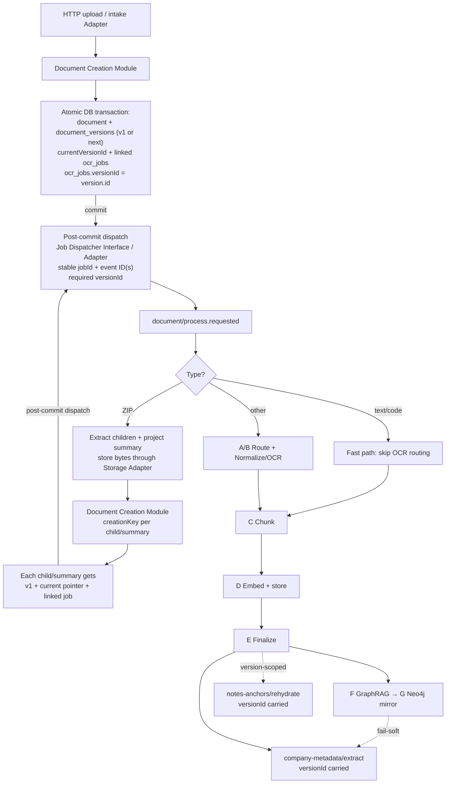

# Document Ingestion Pipeline

> Grounded in `main` as of 2026-07-19.

> **⚠️ Historical snapshot — partially superseded.** This document describes
> the pre-outbox pipeline. Since then:
>
> - **The outbox now exists.** "The dispatcher is not an outbox" no longer
>   holds: ingestion writes a `source.version.created` row into the
>   transactional outbox (`pdr_ai_v2_event_outbox`) in the same transaction as
>   the source version, and `apps/worker` — the sole durable coordinator —
>   consumes it. See
>   [ADR-003](../architecture/ADR-003-transactional-outbox-and-worker.md) and
>   the [outbox runbook](../runbooks/outbox.md).
> - **The sidecar inference endpoints referenced below (`/embed`,
>   `/extract-entities`, `/rerank`) never existed in this repository** and the
>   dangling providers were removed per
>   [ADR-004](../architecture/ADR-004-compute-service-consolidation.md). The
>   former `sidecar/` and `ocr-router`/`ocr-worker` runtimes are now
>   `services/transcription`, `services/document-editor`, and
>   `services/document-converter`.
>
> Read the rest of this document as the historical baseline those ADRs
> changed, not as the current flow.

---

## 1. Summary

Every active intake path enters through an intake Adapter and the **Document
Creation Module**. For a processable document, one database transaction writes
the `document`, its `document_versions` v1 row, the
`document.currentVersionId` pointer to v1, and one `ocr_jobs` row linked to
both the document and version. A stable `creationKey` is the idempotency seam
for that lifecycle.

Only after the transaction commits does the Module call the Job Dispatcher
Interface/Adapter for `document/process.requested`. The request carries the
stable `jobId` and required `versionId`; the dispatch result exposes runner
event ID(s). A dispatch or fail-hard pipeline failure marks that same linked job
`failed`; the job remains retryable, and a retry reuses the document/version/job
identity.

One durable function (`process-document`) runs stages **A → G** inline as
memoized steps: route → OCR → chunk → embed/store → finalize → GraphRAG
extract (Postgres) → Neo4j mirror. On success it chains
`company-metadata/extract.requested` and the version-scoped
`notes-anchors/rehydrate.requested`. ZIP uploads fan out into child documents
and a project summary, with every child and summary going back through the
Document Creation Module; text/code files take a fast path that skips OCR
routing.

**Stores:** Postgres + pgvector (relational, vectors, graph source of truth),
Neo4j (graph mirror), object storage (raw bytes through the existing Storage
Adapter). The lifecycle boundary is a database transaction; no outbox or AWS
storage migration is part of this flow.

---

## 2. Where the code lives

```
HTTP/intake Adapters  apps/web  …/api/uploadDocument, website, github-repo,
                       …/services/document-upload.ts
       ↓
Document Creation Module
                       apps/web/src/server/services/document-creation.ts
       ↓ (commit, then dispatch)
Job Dispatcher Interface packages/core  …/jobs/types.ts
                       dispatch seam: …/ocr/trigger.ts
       ↓
process-document       apps/web  …/inngest/functions/processDocument.ts
       ↓
runDocIngestionTool    packages/features  …/doc-ingestion/index.ts   ← stages A–G
       ↓
OCR / embed / graph    packages/core  …/ocr/processor.ts, …/graph/, …/ingestion/
```

The runner is an Adapter behind the Job Dispatcher Interface; the lifecycle
Module does not put runner-specific writes in its transaction.

---

## 3. Flow



### Stages (A → G)

Orchestrator: [`runDocIngestionTool`](../../packages/features/src/doc-ingestion/index.ts).
Each `runStep` becomes an Inngest `step.run` (memoized on retry).

| Step                  | What                                                       | Writes                                                                                  |
| --------------------- | ---------------------------------------------------------- | --------------------------------------------------------------------------------------- |
| Upload / lifecycle    | Intake Adapter + Document Creation Module                  | `document`, `document_versions` (v1 or next), `currentVersionId`, linked `ocr_jobs`     |
| Dispatch              | Post-commit Job Dispatcher Interface                       | `document/process.requested` with stable `jobId`, event ID(s), and required `versionId` |
| **A** Route           | Pick OCR path (SigLIP optional)                            | —                                                                                       |
| **B** Normalize / OCR | Azure / Landing.AI / Datalab / OSS / pdfjs; VLM enrichment | pages → `ocr_jobs.ocrResult`                                                            |
| **C** Chunk           | Parent/child text units                                    | chunks → `ocr_jobs.ocrResult`                                                           |
| **D** Embed / store   | OpenAI 1536-dim **or** sidecar `/embed`                    | `document_structure`, `document_context_chunks`, `document_retrieval_chunks`            |
| **E** Finalize        | Mark success                                               | `document_metadata`; `ocrProcessed=true`; `ocr_jobs.status=completed`                   |
| **F** GraphRAG        | Entities + relationships (one step)                        | Postgres `kg_*`                                                                         |
| **G** Neo4j sync      | Mirror from `kg_*`                                         | `:Entity` / `:Section` + edges                                                          |
| Downstream            | Separate Inngest fns                                       | `company_metadata`; version-scoped note-anchor rehydrate                                |

Every processing event and `runDocIngestionTool` call supplies a required
`versionId`. Stage C/D writes carry that version; downstream document work
receives the same version identity. Retrieval joins versioned rows to
`document.currentVersionId`; historical rows remain stored for version
operations but are not current retrieval results.

**A/B in code:** Azure PDFs use `step-a-router` + `step-b-normalize`; everything else uses one
`step-ab-ingest` step. There is no separate “F2” — entities and relationships are extracted
together.

**Branches** ([`processDocument.ts`](../../apps/web/src/server/inngest/functions/processDocument.ts)):

- **ZIP** — extract entries (cap 500, 10 MB/file), store child and summary bytes through the
  Storage Adapter, and call the Document Creation Module for each child/summary with stable
  archive creation keys. The Module creates each v1/current/job lifecycle and dispatches after
  commit; the ZIP handler does not directly insert lifecycle rows or jobs. After fan-out, the
  original ZIP document and job are deleted.
- **Text fast-path** — mime/extension skip OCR (`fastTextPath: true`) → chunk/embed onward.

**Inngest config:** `retries: 5`, concurrency 3, throttle 30/min, finish timeout 120m, plus
`onFailure`.

---

## 4. What gets written

| Store              | Pipeline tables / artifacts                                                                                                                                                                                                                                                                                                         |
| ------------------ | ----------------------------------------------------------------------------------------------------------------------------------------------------------------------------------------------------------------------------------------------------------------------------------------------------------------------------------- |
| **Postgres**       | `document` (including `currentVersionId`), `document_versions`, `ocr_jobs` (version-linked job + scratch state in `ocrResult`), `document_structure`, `document_context_chunks`, `document_retrieval_chunks` (`vector(1536)` + short `vector(512)`), `document_metadata`, `kg_entities` / `kg_entity_mentions` / `kg_relationships` |
| **Neo4j**          | Mirror only — `:Entity`, `:Section`, `:MENTIONED_IN`, dynamic rel types. Full text stays in Postgres.                                                                                                                                                                                                                               |
| **Object storage** | Raw bytes through the existing Storage Adapter. No outbox or AWS migration is implied.                                                                                                                                                                                                                                              |

Schema sources: [`packages/core/src/db/schema/`](../../packages/core/src/db/schema/),
[`neo4j-sync.ts`](../../packages/core/src/graph/neo4j-sync.ts).

Postgres `kg_*` is the graph source of truth; Neo4j is the mirror.

---

## 5. What “done” means

| Milestone     | Meaning                                                                                                                             |
| ------------- | ----------------------------------------------------------------------------------------------------------------------------------- |
| After **E**   | The current version is searchable (version-tagged chunks + embeddings). UI treats `ocrProcessed=true` as ready. Job is `completed`. |
| After **F/G** | Graph enrichment — **optional**. Fail-soft: a `completed` doc may have zero `kg_*` / Neo4j nodes.                                   |
| Downstream    | Company metadata refresh; note-anchor rehydrate receives the processed `versionId` (especially useful for later versions).          |

`completed` ≠ “fully enriched.” It means fail-hard stages (OCR, embed, DB store) succeeded.

---

## 6. How to read progress

There is **no** single `UPLOADED → … → EMBEDDED` enum. Infer progress from
`ocr_jobs.status` + `document.ocrProcessed` / `ocrMetadata` + presence of
chunk/`kg_*` rows + the Inngest run.

The processing runner uses memoized steps; lifecycle and failure handlers own
the durable job status:

```
ocr_jobs.status:  queued  ──(Step E)────────────────▶  completed
                     │
                     └──(dispatch/pipeline failure)▶  failed
                                                       │
                                                       └──(retry)──▶ queued
```

- A failed job remains linked to its document and `versionId`, with an error
  message, and is retryable with the same stable `jobId`/version identity.
- On fail-hard pipeline failure, `document.ocrProcessed=false` and
  `ocrMetadata.error="processing_failed"`; a failure is not represented as an
  indefinitely queued job.
- A retry resets the failed job to `queued` before re-dispatching. Do not use
  `queued` alone to distinguish a newly dispatched job from one awaiting retry.

---

## 7. Dependencies & failure posture

**Required for a successful ingest:** Postgres + pgvector, the configured Job
Dispatcher Adapter (Inngest today), object storage, an embedding producer
(OpenAI **or** sidecar `/embed` — dims must match `vector(1536)`), plus an OCR
path for non-text files.

**Optional:** Neo4j, ML sidecar NER, cloud OCR providers (local can use pdfjs / OSS), VLM
enrichment.

| Kind          | Stages                         | Effect                                                                                                            |
| ------------- | ------------------------------ | ----------------------------------------------------------------------------------------------------------------- |
| **Fail-hard** | OCR, embedding, DB storage     | Runner retries 5× → failure handler marks the linked job `failed`; retry reuses its document/version/job identity |
| **Fail-soft** | VLM enrichment, Step F, Step G | Doc still marked `completed`                                                                                      |

**“Sidecar” naming trap:** `SIDECAR_URL` points at an **external** ML worker (`/embed`,
`/extract-entities`, `/rerank`). This repo’s [`sidecar/`](../../sidecar/app/main.py) is a
separate DOCX/Whisper service — it does **not** implement those endpoints.

**Idempotency:** `creationKey` makes Document Creation Module retries converge on
the same document/version rows and linked stable job ID. Archive children and
the summary use deterministic archive creation keys, so ZIP retries do not
directly duplicate lifecycle rows. Inngest step memoization, chunk `contentHash`
deduplication, Neo4j `MERGE`, and KG upserts provide the stage-level
protections; arbitrary stage inserts should not be treated as globally
idempotent outside their memoized step.

**Current-version retrieval:** Versioned retrieval, structure, metadata, and
graph queries require `row.versionId = document.currentVersionId` for the same
document. There is no fallback to an unversioned row or merely the latest row;
historical version rows stay available for version operations but are excluded
from current retrieval. A missing or invalid current pointer therefore yields
no authoritative current-version result until repaired.

Legacy state is repaired by the `2026-08-document-versions` backfill
([`apps/web/src/server/backfills/document-version-repair.ts`](../../apps/web/src/server/backfills/document-version-repair.ts)),
run with `pnpm --filter @launchstack/web db:backfill --only=2026-08-document-versions`.
The idempotent repair backfills v1, repairs the current pointer and version
links, and completes legacy RLM/job linkage; it does not redispatch work or
touch storage.
