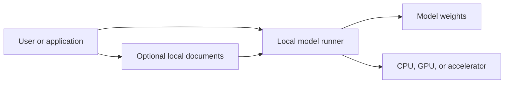

# Local LLMs

> [!abstract]
> A local large language model runs on hardware you control instead of sending every request to a hosted AI service.

## Why run an LLM locally?

Local models are especially useful when privacy, offline access, predictable cost, or control matters.

### Advantages

- **Privacy:** Prompts and documents can remain on the device.
- **Offline access:** The model works without an internet connection after setup.
- **Control:** Models, system prompts, context, and retention policies are configurable.
- **Predictable cost:** There is no per-token API fee, although hardware and electricity still cost money.
- **Experimentation:** Models can be swapped, tuned, and integrated into local workflows.

### Tradeoffs

- Local models may be less capable than the strongest hosted models.
- Inference speed depends heavily on available memory and compute.
- Installation, updates, and troubleshooting become the user's responsibility.
- A model running locally is not automatically safe; applications can still log or expose data.

## The basic stack

A typical setup contains:

1. **Model weights** — The learned parameters stored on disk.
2. **Inference runtime** — Software that loads and executes the model.
3. **Interface** — A chat application, command-line tool, editor extension, or API.
4. **Optional retrieval layer** — A system that finds relevant passages in local documents and adds them to the prompt.

## Choosing a model

The most important constraints are:

- **Available memory:** The model and its working context must fit in RAM or VRAM.
- **Task:** Coding, writing, reasoning, extraction, and multilingual work may favor different models.
- **Latency:** Smaller models generally answer faster.
- **Context length:** Larger contexts support longer documents but consume more memory.
- **License:** Confirm that the model's license permits the intended personal or commercial use.

> [!tip] Start small
> Begin with a quantized model that fits comfortably in memory. A model that responds quickly is often more useful than a larger one that barely runs.

## Quantization

Quantization stores model parameters at reduced numerical precision. This usually lowers memory use and can improve speed, with some loss of output quality.

In practical terms:

- Higher precision usually means better fidelity and greater memory use.
- Lower precision usually means smaller files and faster inference.
- The best balance depends on the model, hardware, and task.

## Local document search

A local LLM does not automatically know what is inside personal files. A retrieval-augmented generation workflow can:

1. Split documents into passages.
2. Create searchable representations of those passages.
3. Retrieve passages relevant to a question.
4. Provide them to the model as context.
5. Generate an answer grounded in the retrieved material.

This approach is commonly called **RAG**. See [[Retrieval-Augmented Generation]].

## Security checklist

- [ ] Verify where the model and application were downloaded from.
- [ ] Review whether chat history or telemetry is enabled.
- [ ] Bind local API servers to the loopback interface unless network access is intentional.
- [ ] Avoid placing secrets directly in prompts or configuration files.
- [ ] Check model licenses before commercial use.
- [ ] Back up important configurations and prompts.

## A sensible first experiment

1. Install one trusted local model runner.
2. Select a small instruct model that fits comfortably in memory.
3. Test it with five real tasks you perform regularly.
4. Record response quality, speed, and memory use.
5. Compare the results with a hosted model before expanding the setup.

## Questions to explore

- Which tasks genuinely benefit from staying local?
- How much quality am I willing to trade for privacy or speed?
- Does the model need access to local documents?
- Should the model expose an API to other applications?
- What information should never enter the workflow?

## Related notes

- [[Retrieval-Augmented Generation]]
- [[AI Privacy Threat Model]]
- [[Model Quantization]]
- [[Local-First Software]]
